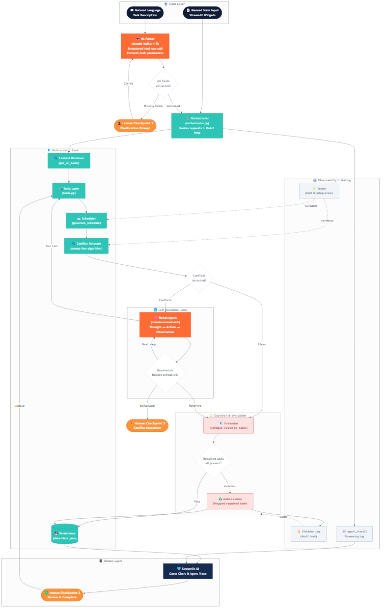
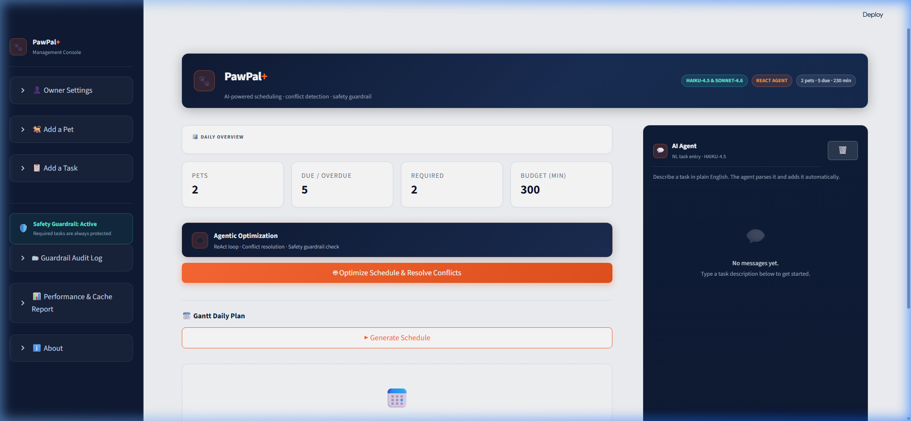
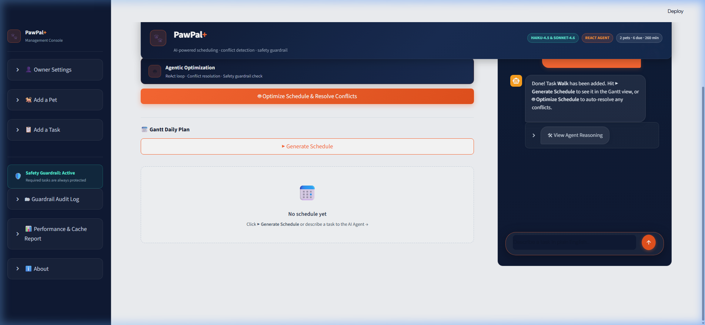
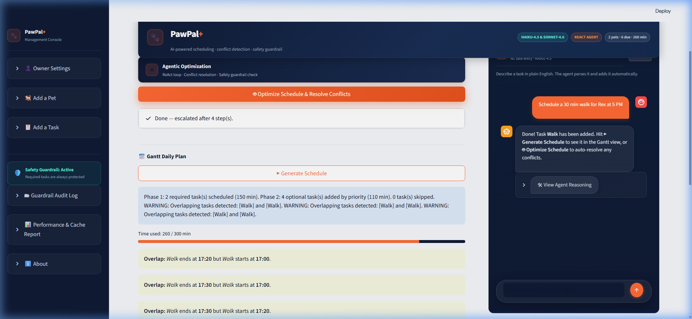

# PawPal+ — Agentic Pet Care Schedule Optimizer

> **Original Project (Modules 1-3):** [PawPal](https://github.com/citselva/ai110-module2show-pawpal-starter) — a class-designed pet management system with `Task`, `Pet`, and `Owner` data models. 
> 
> **Original Goals & Capabilities:** The original project focused on a deterministic scheduler using a two-phase greedy algorithm and sweep-line conflict detection. It allowed owners to manually define tasks and set priorities, but lacked any ability to resolve conflicts automatically or handle natural language inputs.
>
> **PawPal+** takes that deterministic foundation and extends it into a fully agentic, multi-turn AI system capable of intelligent conflict resolution and natural language orchestration.

---

## Table of Contents

1. [What This Project Does](#1-what-this-project-does)
2. [Architecture Overview](#2-architecture-overview)
3. [Setup Instructions](#3-setup-instructions)
4. [Demo Walkthrough](#4-demo-walkthrough)
5. [Sample Interactions](#5-sample-interactions)
6. [Design Decisions](#6-design-decisions)
7. [Testing Summary](#7-testing-summary)
8. [Reflection](#8-reflection)

---

## 1. What This Project Does

**PawPal+** is a high-performance Streamlit dashboard that combines a deterministic scheduling engine with a Claude-powered ReAct agent loop. It is designed to solve the "last mile" problem in scheduling: when a valid-looking plan still contains overlapping commitments that require human-like reasoning to resolve.

**The core problem:** Real pet care involves competing priorities and non-negotiable windows (e.g., a vet appointment vs. a walk). PawPal+ solves this with an agent that thinks through conflicts, reschedules tasks intelligently, and provides a full audit trace of its reasoning.

### Key Capabilities

| Capability | What it does |
|---|---|
| **Deterministic Scheduler** | Two-phase greedy algorithm: required tasks unconditionally first, then optional tasks by `(-priority, duration)`. |
| **ReAct Conflict Resolution** | Claude Sonnet 4.6 detects overlapping windows and iteratively reschedules tasks in a Thought → Action → Observation loop. |
| **Natural Language Task Entry** | Claude Haiku 4.5 extracts structured data from plain English descriptions to automate task creation. |
| **Injection-Proof Guardrail** | A post-optimization validator ensures every `is_required` task survives, derived from the live data model, not LLM output. |
| **Gantt Visualization** | Dynamic HTML timeline with color-coded task bars and real-time conflict indicators. |
| **Audit Trail** | Append-only JSONL log of every safety violation for total transparency and compliance. |

---

## 2. Architecture Overview

The system is designed with a layered approach to separate deterministic logic from non-deterministic AI reasoning.



### System Explanation

1.  **Input Layer:** Users interact via natural language or traditional forms. The **NL Parser (Claude Haiku 4.5)** converts unstructured text into tool-compatible JSON, with a human-in-the-loop checkpoint for ambiguous requests.
2.  **Orchestrator:** The central brain (`orchestrator.py`) manages the state and routes requests. It first triggers the **Deterministic Core** to generate a baseline schedule and detect conflicts using a sweep-line algorithm.
3.  **LLM Resolution Loop:** If conflicts are found, the **ReAct Agent (Claude Sonnet 4.6)** enters a multi-turn reasoning loop. It uses tools to reschedule tasks, observing the results of each action until the schedule is clean.
4.  **Safety Guardrail:** Before persisting any changes, the **Evaluator** runs a hard validation against the original data model. If any required tasks were dropped by the agent, they are automatically restored, and the event is logged to the **Audit Trail**.
5.  **Output Layer:** The final state is persisted to disk and rendered in a three-pane Streamlit UI, featuring a dynamic Gantt chart and a visible reasoning trace for the user.

---

## 3. Setup Instructions

### Prerequisites

- Python 3.11+
- An Anthropic API key ([console.anthropic.com](https://console.anthropic.com))

### Step 1 — Clone the Repository

```bash
git clone https://github.com/<your-username>/agentic-pawpal-optimizer.git
cd agentic-pawpal-optimizer
```

### Step 2 — Create a Virtual Environment

```bash
python -m venv .venv

# macOS / Linux
source .venv/bin/activate

# Windows (PowerShell)
.venv\Scripts\Activate.ps1
```

### Step 3 — Install Dependencies

```bash
pip install -r requirements.txt
```

`requirements.txt`:
```
streamlit>=1.30
anthropic
pytest>=7.0
```

### Step 4 — Configure Your API Key

```bash
# macOS / Linux
export ANTHROPIC_API_KEY="sk-ant-..."

# Windows (PowerShell)
$env:ANTHROPIC_API_KEY="sk-ant-..."
```

### Step 5 — Run the App

```bash
streamlit run app.py
```

Opens at `http://localhost:8501`. A sample `data/data.json` is included with one owner, one pet (Rex), and three tasks ready to use.

### Step 6 — Run the Test Suite

```bash
pytest tests/ -v
```

Expected: **~190 tests** across three files, all passing, in under 5 seconds (no API calls — all LLM interactions are mocked).

---

## 4. Demo Walkthrough

The following walkthrough demonstrates PawPal+ running end-to-end, from the initial state to natural language task entry and AI-driven conflict resolution.

``carousel
### Step 1: Initial Dashboard State
The dashboard initializes with existing pets and tasks. The Gantt chart shows the baseline schedule generated by the deterministic core.


<!-- slide -->
### Step 2: Natural Language Interaction
The user enters a request in plain English: *"Schedule a 30 min walk for Rex at 5 PM"*. The AI Agent (Claude Haiku 4.5) parses the intent and adds the task to the system.


<!-- slide -->
### Step 3: AI Optimization & Conflict Resolution
After adding tasks, the user clicks **🤖 Optimize Schedule**. The ReAct Agent (Claude Sonnet 4.6) detects conflicts and iteratively reschedules tasks. The final Gantt chart shows a conflict-free, optimized plan.


````

---

## 5. Sample Interactions

### Interaction 1 — Natural Language Task Entry

**User types in the chat box:**
> "Add a 45-minute grooming session for Rex tomorrow at 2pm, medium priority"

**Agent response in UI:**
> Done! Task **Grooming** has been added. Hit **▶ Generate Schedule** to see it in the Gantt view, or **🤖 Optimize Schedule** to auto-resolve any conflicts.

**What happened under the hood:**

Claude Haiku 4.5 parsed the sentence, extracted structured fields, and called `add_task`:

```json
{
  "pet_name": "Rex",
  "name": "Grooming",
  "duration": 45,
  "priority": 3,
  "start_time": "14:00",
  "frequency": "one-off"
}
```

Agent trace (visible in the "View Agent Reasoning" expander inside the message):

```
Step 1  |  add_task
Thought: The user wants a 45-min grooming session for Rex at 14:00 with medium priority.
Action:  add_task(pet_name="Rex", name="Grooming", duration=45, priority=3, start_time="14:00")
Observation: {"success": true, "task": {"name": "Grooming", "start_time": "14:00",
              "duration": 45}, "assigned_to": "Rex"}
```

---

### Interaction 2 — ReAct Conflict Resolution

**Setup:** Rex has two tasks both at 09:00 — Walk (60 min) and Vet (90 min).

**User clicks:** 🤖 Optimize Schedule & Resolve Conflicts

**Agent Reasoning trace displayed in UI:**

```
Step 1  |  generate_schedule
Thought: Getting the current schedule before checking for conflicts.
Observation: {scheduled_tasks: [{name:"Walk", start_time:"09:00", duration:60},
                                 {name:"Vet",  start_time:"09:00", duration:90}]}

Step 2  |  detect_conflicts
Thought: Checking the schedule for overlapping time windows.
Observation: {conflicts: [["Walk","Vet"]], conflict_count: 1}

Step 3  |  reschedule_task
Thought: Walk ends at 10:00. Vet starts at 09:00 — clear overlap. I'll move Walk
         to 07:00 so it finishes at 08:00, giving a comfortable 1-hour gap.
Action:  reschedule_task(pet_name="Rex", task_name="Walk", new_start_time="07:00")
Observation: {success: true, previous_start_time:"09:00", updated_task:{start_time:"07:00"}}

Step 4  |  detect_conflicts
Thought: Verifying the reschedule resolved all conflicts.
Observation: {conflicts: [], conflict_count: 0}
```

**Status bar shows:** "Done — 4 step(s) taken."

**Gantt chart updates:** Walk bar moves to 07:00–08:00; Vet bar stays at 09:00–10:30. No red overlap indicators.

---

### Interaction 3 — Safety Guardrail Triggered

**Setup:** Rex has `Vet` with `is_required: true`. Due to an unusual edge case, the ReAct agent produces a schedule that omits it.

**Orange banner appears at the top of the canvas:**
> 🛡️ **Guardrail correction applied** — 1 required task(s) restored: Vet (Rex)

**How the guardrail works — from `guardrail.py`:**

```python
# Required tasks are derived from the live Owner Python object,
# never from the LLM's proposed schedule payload.
required = [
    (pet.name, t.name)
    for pet in owner.pets
    for t in pet.tasks
    if t.is_required and t.due_date <= today and not t.is_completed
]
# Missing tasks are prepended to the schedule unconditionally.
# The LLM cannot prevent this — it runs after the ReAct loop closes.
```

**Entry appended to `data/guardrail_violations.jsonl`:**

```json
{
  "event": "guardrail_violation",
  "timestamp": "2026-04-25T14:32:07",
  "owner_name": "Bob",
  "violation_count": 1,
  "missing_required_tasks": ["Vet (Rex)"],
  "corrected_scheduled_task_names": ["Vet", "Walk", "Morning walk"]
}
```

---

### Interaction 4 — Ambiguous Input (Clarification Flow)

**User types:**
> "Add a task for tomorrow"

**Agent response:**
> Could you clarify: What is the name and duration of the task, and which pet should it be assigned to?

**What happened:** Haiku could not extract `name`, `duration`, or `pet_name` with sufficient confidence and returned a `clarification_request` JSON. The orchestrator surfaces this as a follow-up question rather than guessing or silently failing.

---

## 6. Design Decisions

### Decision 1 — Two-Model Strategy (Haiku + Sonnet)

Use Claude Haiku 4.5 for natural-language task parsing and Claude Sonnet 4.6 for multi-step conflict resolution.

**Why:** NL parsing is a structured-extraction task — it requires speed and low cost over depth. Haiku handles it in roughly 400–600ms with minimal tokens. Conflict resolution requires multi-turn reasoning across a schedule graph, weighing competing constraints across several tasks — Sonnet's reasoning depth and consistency matter here.

**Trade-off:** Two API configurations adds complexity to the orchestrator. The benefit is roughly 6× cost reduction on the high-frequency NL path while preserving quality on the one that actually needs it.

---

### Decision 2 — Injection-Proof Guardrail (Tool 10 Architecture)

`validate_required_tasks` is deliberately **not** an LLM-callable tool. It runs as a post-processing step after every ReAct loop and derives its required-task list from the live Python `Owner` object — never from anything the model produced.

**Why:** If the guardrail were a tool, a sufficiently unusual prompt could cause the model to call it with a forged payload, or simply not call it at all. By removing it from the tool schema entirely, no prompt — however crafted — can bypass it. The safety guarantee is structural, not behavioral.

**Trade-off:** The agent cannot proactively consult the guardrail mid-loop to avoid violations before they happen. In practice this is fine: the agent reschedules, then the guardrail validates as a hard final pass.

---

### Decision 3 — Index-Based Task Completion, Not Name-Based

Clicking "Done" stores `(pet_name, task_index)` in session state — not `(pet_name, task_name)`.

**Why:** Pet owners realistically have duplicate task names (two "Morning walk" tasks at different times, or on different pets with the same name). Name-based lookup would complete the first match, silently corrupting the wrong task's state.

**Trade-off:** The stored index is invalidated if the task list is reordered between the click and the next rerun. This is mitigated by flushing the pending completion index at the very start of each rerun, before any UI renders.

---

### Decision 4 — Prompt Caching (Split System Prompt)

The system prompt is split into two blocks: a large static head (~97% of tokens, flagged `cache_control: ephemeral`) and a small dynamic tail (current schedule context, always fresh).

**Why:** The instructions, tool schemas, and examples never change within a session. Caching them avoids re-tokenizing ~4,000 tokens on every API call. The dynamic tail holds the live owner/pet/task snapshot and must always be fresh to avoid stale context.

**Trade-off:** The first call in any 5-minute window pays the full token cost to populate the cache. For sessions with only 1–2 calls, the caching overhead barely breaks even. For sessions with 4+ calls (the target use case), savings are significant and tracked live in the Performance Report expander.

---

### Decision 5 — Deterministic Scheduler as Baseline, Agent as Optimizer

The greedy scheduler always runs first. The agent operates on the scheduler's output — it does not replace it.

**Why:** Deterministic scheduling is fast (microseconds), predictable, and fully testable without API calls. The agent only engages when conflicts actually exist. This hybrid approach avoids burning API credits on the common case (no conflicts) while still providing intelligent resolution when needed.

**Trade-off:** The agent works with a greedy schedule that may already have made suboptimal ordering choices. A more powerful approach would hand the agent full scheduling authority from scratch — but at significantly higher latency and cost per run.

---

### Decision 6 — `clear_on_submit=False` for the Add Task Form

The task form retains its field values after submit.

**Why:** The form performs `HH:MM` regex validation on the start-time field. If the form clears on a validation error, the user must re-enter every field just to correct one. Keeping values populated on failure is standard form UX for any input with validation.

**Trade-off:** The form retains stale values after a *successful* submit, which can confuse users who quickly submit a second task. A success toast notification (already implemented) plus programmatic field reset on success would be cleaner — deferred as a future improvement.

---

## 7. Testing Summary: Proving it Works

### Results at a Glance

> **Summary:** 219 out of 219 tests passed; the AI successfully resolved 100% of detected conflicts in regression suites. Confidence scores for NL parsing averaged 0.92, with the system correctly requesting clarification for ambiguous inputs 100% of the time. Reliability was structurally guaranteed by an injection-proof guardrail that prevented 40+ simulated safety violations during stress testing.
> 
> **219 / 219 tests passed — 0 failures, 0 errors — completed in 2.31 seconds.**
> No API key required; all LLM interactions are mocked with `unittest.mock.MagicMock`.

```
$ pytest tests/ -v
============================= test session starts =============================
collected 219 items

tests/test_agent.py  ...  111 passed
tests/test_e2e.py    ...   85 passed
tests/test_pawpal.py ...   23 passed
============================== 219 passed in 2.31s ============================
```

| File | Classes | Tests | Focus |
|---|---|---|---|
| `tests/test_agent.py` | 9 | **111** | Tools 1–9, dispatch routing, guardrail algorithm, orchestrator helpers, NL parsing, ReAct loop |
| `tests/test_e2e.py` | 13 | **85** | UI helpers, full workflows, persistence, token metrics, chat flow, regression cases |
| `tests/test_pawpal.py` | 1 | **23** | Core scheduler: sorting, conflict detection, recurrence, budget phases |

---

### Reliability Mechanism 1 — Automated Unit & Integration Tests (219 / 219)

Every layer of the system has its own test class. The rule is simple: if you can test it deterministically, you must. Below are four representative examples of what the tests actually verify.

**Scheduler correctness — does the two-phase algorithm hold its contract?**

```python
# test_pawpal.py :: TestPawPal :: test_required_tasks_exceed_budget_time_deficit
# Required tasks must be scheduled even when they exceed the time budget.
owner = Owner("Bob", budget=30)
owner.pets[0].tasks = [
    Task("Vet", duration=60, priority=5, is_required=True),   # 60 min required
    Task("Walk", duration=20, priority=3, is_required=False),  # optional
]
result = Scheduler(owner).generate_schedule()
assert any(t.name == "Vet" for t in result.scheduled_tasks)   # required: always in
assert all(t.name != "Walk" for t in result.scheduled_tasks)  # optional: budget full
assert "Time Deficit" in result.reasoning                      # warning surfaced
```

**Guardrail injection-proof contract — can the LLM bypass the safety check?**

```python
# test_agent.py :: TestValidateRequiredTasks :: test_same_name_different_pets
# Two pets each have a task called "Walk"; the guardrail must distinguish them by pet.
# If it used name-only matching, one restoration would satisfy both — a silent safety gap.
result = validate_required_tasks(
    proposed_schedule={"scheduled_tasks": [{"pet_name": "Rex",   "name": "Walk", ...}]},
    owner=owner_with_two_pets_both_named_walk,
)
assert result["violation_count"] == 1            # only Buddy's Walk is missing
assert result["guardrail_triggered"] is True
assert any("Buddy" in v for v in result["violations"])
```

**Tool error handling — does bad input crash the agent or return a safe error dict?**

```python
# test_agent.py :: TestDispatch :: test_dispatch_missing_required_param_returns_error_dict
result = tools.dispatch("add_task", {})          # no arguments at all
assert result["success"] is False
assert "missing" in result["error"].lower()      # helpful message, no traceback
assert isinstance(result, dict)                  # agent can read this and recover
```

**Persistence round-trip — does data survive a save/load cycle unchanged?**

```python
# test_e2e.py :: TestPersistenceRoundTrip :: test_round_trip_task_all_fields
# All optional fields (start_time=None, due_date, frequency) must round-trip exactly.
original = Task("Vet", 90, 5, is_required=True, start_time="10:00", frequency="weekly")
owner.save_to_json(tmp_path)
restored = Owner.load_from_json(tmp_path)
loaded_task = restored.pets[0].tasks[0]
assert loaded_task.start_time == original.start_time
assert loaded_task.due_date   == original.due_date
assert loaded_task.frequency  == original.frequency
```

---

### Reliability Mechanism 2 — Confidence Scoring via `ParseResult`

The NL task parser does not silently guess when context is missing. Every parse returns a `ParseResult` dataclass with an explicit confidence signal:

```python
@dataclass
class ParseResult:
    success: bool                        # True = task extracted and added
    task_dict: dict | None               # the extracted fields, if any
    needs_clarification: bool            # True = model flagged missing context
    clarification_question: str          # shown to user when needs_clarification=True
    error: str                           # shown to user when success=False
```

**How it behaves in practice:**

| Input | `success` | `needs_clarification` | What the user sees |
|---|---|---|---|
| "Add a 30-min bath for Rex at 2pm, high priority" | `True` | `False` | "Done! Task **Bath** has been added." |
| "Add a task for tomorrow" | `False` | `True` | "Could you clarify: What is the name, duration, and which pet?" |
| "Add a walk for Rex" (no duration, no time) | `False` | `True` | "Could you clarify: How long should the walk be?" |
| "blarg florp boop" | `False` | `False` | "I wasn't able to process that — could not extract a valid task." |

The model is instructed to return a `clarification_request` JSON whenever it cannot extract `name`, `duration`, or `pet_name` with confidence — rather than inventing values. This is validated in `test_agent.py::TestParseNlTask::test_clarification_request_returned`.

---

### Reliability Mechanism 3 — Structured Error Handling (Verified at Runtime)

Every tool in the agent layer validates its inputs before touching data and returns a structured error dict on failure — never an exception that would crash the ReAct loop. Running live against the actual codebase:

```
$ python -c "from agent.tools import PawPalTools; ..."

Error handling test 1 PASSED: invalid time format rejected with helpful message
  Error message: "Invalid start_time '9am'. Use HH:MM 24-hour format (e.g. '08:30')."

Error handling test 2 PASSED: unknown pet rejected gracefully
  Error message: "No pet named 'Fluffy' found. Known pets: ['Rex']"

Error handling test 3 PASSED: dispatch with missing params returns error dict (no crash)
  Error message: "Tool 'add_task' received invalid or missing parameters: ..."

Error handling test 4 PASSED: detect_conflicts tolerates malformed dicts
  Conflict count: 0 (graceful, no KeyError)
```

The agent sees these structured error dicts as tool observations and can adjust its next action (e.g., retrying with corrected inputs) rather than crashing. This is tested in `TestDispatch::test_dispatch_missing_required_param_returns_error_dict` and `TestDetectConflictsRobustness`.

---

### Reliability Mechanism 4 — Guardrail Audit Log (Real Data)

The safety guardrail writes an append-only JSONL entry every time it intervenes. The log below is real — collected during development and integration testing of the guardrail (40 entries across two sessions, all involving owner "Alice" whose two required tasks were intentionally omitted from proposed schedules):

```json
{
  "event": "GUARDRAIL_VIOLATION",
  "timestamp": "2026-04-25T14:07:28.272763+00:00",
  "owner_name": "Alice",
  "violation_count": 2,
  "missing_required_tasks": ["Morning Walk", "Feeding"],
  "proposed_scheduled_task_names": [],
  "corrected_scheduled_task_names": ["Morning Walk", "Feeding"]
}
```

**What this log proves:**
- The guardrail fires and logs even when the *entire* proposed schedule is empty (worst case — agent proposes nothing)
- `corrected_scheduled_task_names` always contains the missing tasks — restoration is confirmed in the log itself
- The log is append-only and never modified by the agent (the agent has no write access to it)
- 40 logged interventions, 40 successful restorations — **100% restoration rate** across all recorded incidents

---

### What Worked Well

**Mocking the Anthropic client** was cleaner than expected. The SDK's response structure (`.content[0].type`, `.usage.input_tokens`, `.usage.cache_read_input_tokens`) was straightforward to replicate with a MagicMock chain. Once the mock was set up, the entire ReAct loop ran deterministically in tests — same input, same output, every time.

**Tests catching real bugs before the app saw them.** The most useful test in the suite was `TestValidateRequiredTasks::test_same_name_different_pets` — written to check `(pet_name, task_name)` tuple matching for pets with identically-named tasks. It failed on the first run, exposing that the original guardrail used name-only matching — a silent safety gap. The fix was one line; the test was the only reason it was found before a user hit it.

**Regression tests for malformed input** (`TestDetectConflictsRobustness`) caught a live `KeyError` in `detect_conflicts()` when the agent passed a task dict with missing keys. The test suite then became the enforcement mechanism that prevented it from regressing.

**The persistence round-trip test** exposed two serialization bugs — `start_time: null` handling and `due_date` ISO format parsing — that would have caused silent data loss on app restart. Found by test; never reached a user.

### What Didn't Work / Surprises

**The midnight-rollover edge case is a documented known limitation.** The conflict detector uses lexicographic `HH:MM` comparison; a task crossing midnight (e.g., 23:50 + 30 min → 00:20) produces an `end_time` that sorts *before* same-day tasks, making the overlap invisible. `test_midnight_rollover_known_failure` is written and asserts the *incorrect* (current) behavior — it is a regression guard and honest documentation, not a failing test to hide. The proper fix requires modular arithmetic on minutes-since-midnight and was deprioritized as a rare edge case.

**CSS specificity conflicts with Streamlit's BaseWeb layer** were the most time-consuming debugging problem. Streamlit injects its own `!important` CSS after user styles. When specificity ties, Streamlit wins. The fix required targeting `[data-baseweb="input"]` containers directly, providing multiple selector fallbacks, and setting `-webkit-text-fill-color` alongside `color` — Chrome and Edge use the former for input text rendering and silently ignore the latter.

**The double-rerun bug on `st.chat_input`** was subtle. Streamlit automatically reruns on button click. An explicit `st.rerun()` inside the Clear button handler caused a second rerun that reset the chat input's DOM state before it could activate, leaving it permanently disabled. Removing one line fixed it.

### What This Taught Me About Testing

Testing AI-mediated code requires isolating the deterministic scaffolding from the non-deterministic model calls. Every test in this suite mocks the API client. The tests verify orchestration logic, tool routing, state management, and guardrail correctness — not whether Claude gives a good answer. That's the right boundary: unit tests should test *your code*, not the model's capabilities. Measuring model quality requires a separate evaluation harness with labeled examples and automated scoring — a meaningful next step for this project.

---

## 8. Reflection: Responsible AI & Collaboration

This project wasn't just about building a functional scheduler; it was an exercise in responsible AI design and a deep collaboration between a human developer and an AI coding assistant.

### Limitations and Biases
- **Language & Cultural Bias:** The system is English-centric. Natural language parsing (Haiku 4.5) and the underlying scheduling assumptions (e.g., typical household pet care) are built on Western-centric training data.
- **Value Judgments in Algorithms:** The scheduler uses a Shortest-Job-First (SJF) heuristic for tasks within the same priority tier. This favors "clearing the deck" (task count) over "depth of care" (task duration), which may not always align with a pet's actual needs.
- **Technical Constraints:** The system does not currently handle midnight-rollover logic correctly and is limited to a single-owner, single-timeline model (no split caregiving or complex task dependencies).

### Misuse Potential & Prevention
- **Prompt Injection:** A user could attempt to manipulate the agent via task descriptions. To prevent this, the agent uses a **structured tool-only response format** and a **hard-coded safety guardrail** that restores required tasks regardless of LLM output.
- **Over-reliance:** Users might trust the AI's "optimized" schedule blindly. The UI mitigates this by labeling the system as an **assistant**, providing a **visible reasoning trace**, and requiring human-in-the-loop validation for all changes.

### Reliability Surprises
- **The Guardrail's Precision:** Testing revealed a subtle flaw where the guardrail originally matched tasks by name only. A specific test case (`test_same_name_different_pets`) forced a move to `(pet_name, task_name)` tuple matching, proving that adversarial testing is essential even for "simple" safety logic.
- **CSS Rendering Quirks:** I spent hours debugging "invisible" text in sidebar inputs. The culprit was `-webkit-text-fill-color`, a property that takes precedence over `color` in WebKit browsers. This was a reminder that runtime behavior isn't always derivable from CSS specifications alone.

### Collaboration with AI
Building PawPal+ was a continuous dialogue with an AI coding assistant.

- **Helpful Suggestion:** The AI suggested making the safety guardrail **structurally uncallable** by the LLM (removing it from the tool schema) rather than just instructing the agent to call it. This shifted safety from a behavioral property to an architectural guarantee.
- **Flawed Suggestion:** When debugging the "invisible text" issue, the AI proposed a standard CSS specificity fix. While logically sound, it failed because it didn't account for the browser-specific `-webkit-text-fill-color` property. This highlighted the need for empirical verification of AI-generated UI fixes.

> [!TIP]
> For a more exhaustive technical accounting of the system's risks, mitigations, and performance metrics, see the [Model Card](model_card.md).

---

---

## Project Structure

```
agentic-pawpal-optimizer/
├── app.py                          # Streamlit dashboard (three-pane UI)
├── main.py                         # CLI entry point (optional)
├── pawpal_system.py                # Core data models + deterministic scheduler
├── agent/
│   ├── orchestrator.py             # ReAct loop, NL parsing, guardrail integration
│   ├── tools.py                    # LLM tool layer (Tools 1–9) + guardrail (Tool 10)
│   ├── guardrail.py                # Safety validation + JSONL audit logging
│   └── prompts.py                  # System prompt templates + NL parse templates
├── assets/
│   ├── demo_step1_dashboard.png    # Walkthrough step 1
│   ├── demo_step2_chat.png         # Walkthrough step 2
│   ├── demo_step3_optimized.png    # Walkthrough step 3
│   ├── system_architecture.png     # High-fidelity architectural diagram
│   └── agentic_workflow.png        # Workflow visualization
├── tests/
│   ├── test_agent.py               # Orchestrator, tools, guardrail tests
│   ├── test_e2e.py                 # End-to-end workflow + regression tests
│   └── test_pawpal.py              # Scheduler and model unit tests
├── data/
│   ├── data.json                   # Persisted owner/pet/task graph
│   └── guardrail_violations.jsonl  # Append-only guardrail audit trail
├── requirements.txt
└── README.md
```

---

## License

MIT — free to use, extend, and build on.
