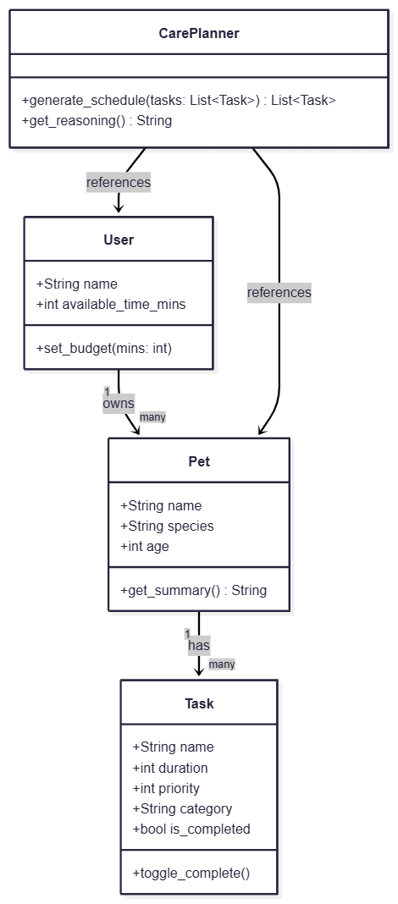
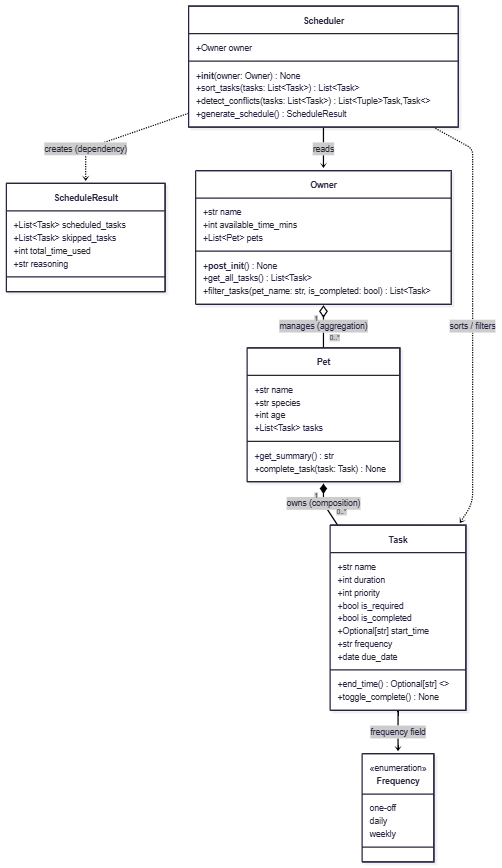
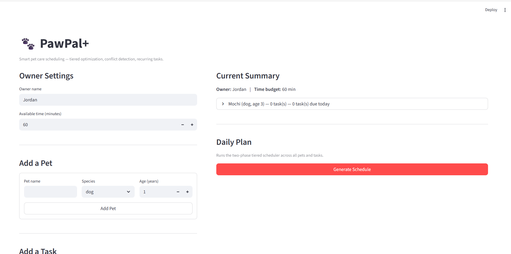

# PawPal+ — Intelligent Pet Care Scheduling

**PawPal+** is a production-quality Streamlit application that transforms chaotic pet care routines into an optimized, conflict-aware daily schedule. Built on proven algorithmic foundations, it guarantees essential care is always delivered while maximizing discretionary task density within any time budget.

---

## Features

| Feature | Algorithm / Mechanism |
|---|---|
| Two-phase required/optional scheduling | Greedy tiered fill with guaranteed Phase 1 correctness |
| Composite priority + SJF sorting | `(-priority, duration)` key — maximizes task count within budget |
| Chronological task ordering | Lexicographic `HH:MM` sort — O(n log n), no datetime parsing |
| Real-time conflict detection | Sweep-line algorithm — O(n) after sort, no auxiliary structures |
| Midnight-safe end-time computation | `@property` via `datetime.strptime` + `timedelta` |
| Daily recurrence | `due_date += timedelta(days=1)` on completion, zero allocations |
| Weekly recurrence | `due_date += timedelta(weeks=1)` on completion, zero allocations |
| One-off task retirement | `is_completed = True` — permanently excluded from scheduler |
| Temporal task filtering | `due_date <= today and not is_completed` gate in `get_all_tasks()` |
| Time Deficit surfacing | Warning injected into reasoning string when required tasks overflow budget |

---

### Tiered Scheduling Intelligence

PawPal+ applies a two-phase scheduling strategy that separates correctness from optimization.

**Phase 1 — Guaranteed Required Care:** All tasks flagged `is_required` are unconditionally committed to the schedule before any optimization logic runs. If their combined duration exceeds the owner's `available_time_mins`, a *Time Deficit* warning is surfaced in the reasoning panel — but the tasks are never dropped. Essential care is non-negotiable.

**Phase 2 — Composite-Key Density Maximization:** Optional tasks are ranked by a `(-priority, duration)` composite sort key. This two-dimensional key encodes a deliberate scheduling philosophy: among tasks of equal priority, shorter tasks are preferred first — a form of Shortest-Job-First (SJF) optimization applied within each priority tier. The greedy fill loop then consumes the remaining time budget, skipping any task that no longer fits. The net effect is that the scheduler maximizes the *number* of tasks completed, not just the highest-priority ones, turning leftover minutes into productive care time.

---

### Real-Time Conflict Awareness

When owners assign explicit `start_time` values to tasks, PawPal+ automatically detects scheduling collisions using a classical **Sweep-Line algorithm** implemented in `detect_conflicts()`.

The algorithm works in two steps:

1. **Sort:** Tasks with a `start_time` are sorted chronologically. Zero-padded `HH:MM` strings are lexicographically equivalent to chronological order, so the sort is O(n log n) with no datetime parsing overhead.
2. **Sweep:** A single left-to-right pass compares each task's `start_time` against the previous task's computed `end_time`. Any pair where `curr.start_time < prev.end_time` is an overlap.

`end_time` is derived via a `@property` on `Task` using `datetime.strptime` + `timedelta`, which handles midnight rollover correctly as a side effect of standard `datetime` arithmetic. The result is O(n) after sorting, with no auxiliary data structures.

Detected conflicts are appended as `WARNING` entries to the schedule's reasoning string and surfaced in the UI immediately — without blocking schedule generation. Owners see the conflict and decide; the app never silently discards a task.

---

### Automated Lifecycle Management

PawPal+ manages task recurrence through a zero-allocation mutation system. `Pet.complete_task()` branches on the `frequency` field of each `Task` and advances state in place using `timedelta`:

| Frequency | Behavior on Completion |
|-----------|------------------------|
| `'daily'` | `due_date` advances by `timedelta(days=1)` — resurfaces tomorrow |
| `'weekly'` | `due_date` advances by `timedelta(weeks=1)` — resurfaces same weekday next week |
| `'one-off'` | `is_completed = True` — permanently retired from the scheduler |

`Owner.get_all_tasks()` enforces temporal relevance by filtering on `task.due_date <= date.today() and not task.is_completed`, so future-dated recurring tasks are invisible to the scheduler until they become actionable, and completed one-off tasks never re-enter the schedule. This creates a perpetual recurrence engine with no background jobs, no polling, and no new object allocations.

---

### System Evolution — UML Design Intent vs. As-Built Reality

The architecture was designed before the first line of code was written, then refined as implementation revealed real-world constraints.

**The Design Intent** — the initial UML diagram drafted before implementation:



**The As-Built Reality** — the final UML diagram reflecting the implemented system:



Key divergences between design and reality (swept into `uml_final.png`) include the addition of the `@property end_time` computed field on `Task`, the `detect_conflicts()` method on `Scheduler`, and the `is_completed` guard in `Owner.get_all_tasks()` — all discovered through test-driven development.

---

## Testing

The scheduling and task-management logic is verified by a structured unit test suite in [tests/test_pawpal.py](tests/test_pawpal.py), covering 23 test cases across five behavioral suites.

### How to Run

```bash
python -m pytest tests/test_pawpal.py -v
```

All 23 tests pass in under 0.2 seconds with no external dependencies beyond `pytest`.

### What is Covered

- **Two-phase scheduler correctness.** Tests verify that `generate_schedule()` unconditionally schedules all `is_required` tasks in Phase 1 — even when their combined duration exceeds `available_time_mins` — and correctly surfaces a Time Deficit warning. Phase 2 greedy fill is verified to respect both the remaining time budget and the `(-priority, duration)` composite sort key.

- **Conflict detection boundary contract.** The sweep-line algorithm is tested at three boundary conditions: genuine overlaps (flagged), tasks sharing an exact end/start boundary (not flagged — the strict `<` operator intentionally defines closed-open intervals), and tasks with no `start_time` (silently excluded). A separate chronological-ordering test confirms that tasks passed in reverse order still produce correct results.

- **Recurrence state transitions.** `complete_task()` is tested for all three frequency modes. Daily and weekly tasks are verified to advance `due_date` by the correct `timedelta` while keeping `is_completed = False`. One-off tasks are verified to set `is_completed = True`. A downstream integration test confirms that `get_all_tasks()` correctly excludes each completed task.

- **Temporal date filtering.** `get_all_tasks()` is verified to include overdue tasks (`due_date < today`) and exclude future-dated tasks (`due_date > today`).

### The 'One-Off' Fix

Test-driven development identified a state-filtering defect in `Owner.get_all_tasks()`. The original implementation filtered only on `task.due_date <= today` with no guard on `task.is_completed`. A completed one-off task would retain its original `due_date`, pass the temporal filter, and re-enter `generate_schedule()` in the same session.

The fix adds `and not task.is_completed` as a second guard in the list comprehension. Because `get_all_tasks()` is the single entry point for all scheduler input, this one-line change propagates the correction across both scheduling phases without modifying any downstream logic.

> ⭐⭐⭐⭐⭐ — 23/23 tests passing. All critical scheduling contracts, recurrence state transitions, and conflict detection boundaries are verified. One production defect was identified and resolved through the test suite.

---

## 📸 Demo

<a href="docs/app_screenshot.png" target="_blank"></a>

---

## Getting Started

### Setup

```bash
python -m venv .venv
source .venv/bin/activate  # Windows: .venv\Scripts\activate
pip install -r requirements.txt
```

### Run the App

```bash
streamlit run app.py
```

### Suggested Workflow

1. Read the scenario and identify requirements and edge cases.
2. Draft a UML diagram (classes, attributes, methods, relationships).
3. Convert UML into Python class stubs (no logic yet).
4. Implement scheduling logic in small increments.
5. Add tests to verify key behaviors.
6. Connect logic to the Streamlit UI in `app.py`.
7. Refine UML so it matches what you actually built.

---

## Scenario

A busy pet owner needs help staying consistent with pet care. They want an assistant that can:

- Track pet care tasks (walks, feeding, meds, enrichment, grooming, etc.)
- Consider constraints (time available, priority, owner preferences)
- Produce a daily plan and explain why it chose that plan

PawPal+ solves this with a provably correct two-phase scheduler, real-time conflict detection, and a zero-overhead recurrence engine — all connected to an accessible Streamlit UI.
