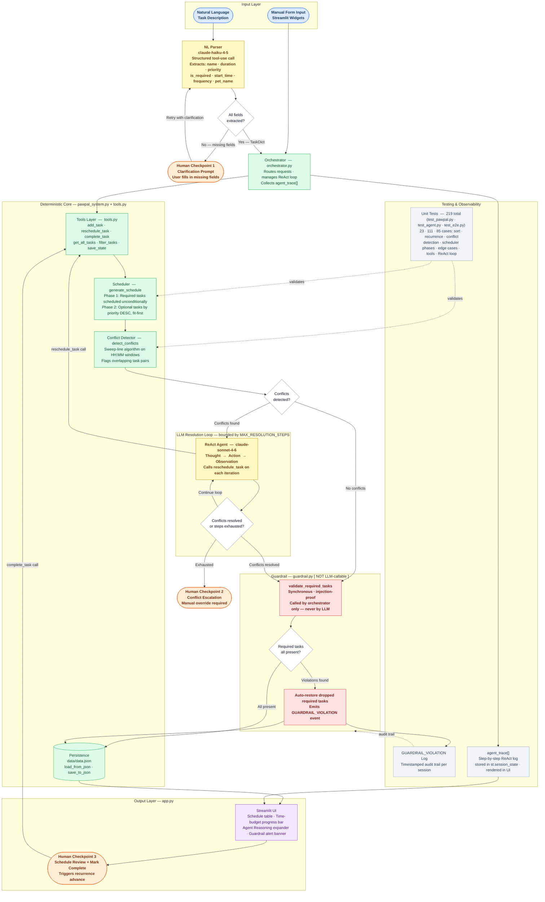

# REQUIREMENTS EXTENSION — Agentic PawPal Optimizer

**Status:** Final  
**Date:** 2026-04-26  
**Author:** Selvakumar Thirumalainambi  
**Base branch:** `main` (M2 deterministic scheduler)

---

## 1. Current State — M2 Deterministic Logic

### 1.1 Data Model (`pawpal_system.py`)

| Class | Responsibility |
|---|---|
| `Task` | A single care activity: `name`, `duration` (min), `priority` (1–5), `is_required`, `is_completed`, `start_time` (HH:MM), `frequency` (one-off / daily / weekly), `due_date` |
| `Pet` | A pet with species, age, and a list of `Task` objects; owns the `complete_task()` recurrence logic |
| `Owner` | The scheduler's entry point: holds `available_time_mins`, a list of `Pet`s, and JSON persistence |
| `Scheduler` | Stateless service that accepts an `Owner` and produces a `ScheduleResult` |
| `ScheduleResult` | Immutable value object: `scheduled_tasks`, `skipped_tasks`, `total_time_used`, `reasoning` |

### 1.2 Scheduling Algorithm

`Scheduler.generate_schedule()` runs a **two-phase greedy algorithm**:

1. **Phase 1 — Required tasks:** Every task flagged `is_required=True` is unconditionally appended to the schedule, even if the aggregate duration exceeds `available_time_mins`. A *Time Deficit* warning is written to `reasoning` when this occurs.
2. **Phase 2 — Optional tasks:** Tasks are sorted by `(-priority, duration)` and greedily added while the remaining time budget allows. Tasks that do not fit enter `skipped_tasks`.
3. **Conflict check:** `detect_conflicts()` runs a sweep-line over tasks that carry a `start_time`, comparing adjacent `[start_time, end_time)` windows. Overlapping pairs append a `WARNING` to `reasoning`.

### 1.3 Recurrence Model

`Pet.complete_task(task)` handles three frequencies in-place:

- `daily` → advances `task.due_date` by 1 day; task is NOT retired.
- `weekly` → advances `task.due_date` by 7 days; task is NOT retired.
- `one-off` → sets `task.is_completed = True`; task is retired from future `get_all_tasks()` calls.

### 1.4 Persistence

`Owner.save_to_json(path)` / `Owner.load_from_json(path)` provide round-trip JSON serialization. The Streamlit app rehydrates session state from `data/data.json` on first load.

### 1.5 Known Limitations

| ID | Description |
|---|---|
| `KL-01` | `detect_conflicts()` sorts `start_time` lexicographically; midnight-crossing overlaps (e.g. 23:50 → 00:20) are silently missed (documented in `test_midnight_rollover_known_failure`). |
| `KL-02` | Conflict resolution is passive — the UI only surfaces a warning; no automated fix is applied. |
| `KL-03` | Task creation is entirely manual via form inputs; there is no natural-language entry path. |
| `KL-04` | The scheduler is a pure function; it cannot iteratively negotiate a better schedule when constraints are violated. |

---

## 2. Functional Requirements — Agentic Extension

### 2.1 FR-NL — Natural Language Input Parsing

**Goal:** Allow the owner to describe tasks in plain English instead of filling in every form field.

| ID | Requirement |
|---|---|
| `FR-NL-01` | The system MUST accept a free-text string (e.g. *"Buddy needs a 30-minute walk every morning at 8 AM, it's required"*) and extract a fully-formed `Task` object. |
| `FR-NL-02` | Extracted fields: `name`, `duration`, `priority` (inferred from urgency words), `is_required`, `start_time`, `frequency`, and the target `pet_name`. |
| `FR-NL-03` | Any field that cannot be confidently extracted MUST be surfaced to the user as a clarification question before the task is committed. |
| `FR-NL-04` | Parsing MUST be performed by the LLM via a structured output / function-call tool so the result is a validated `Task` dict, not a free-form string. |
| `FR-NL-05` | If the named pet does not exist the agent MUST ask whether to create it or assign to an existing pet. |

### 2.2 FR-RL — LLM-Driven Conflict Resolution Loop

**Goal:** When `detect_conflicts()` returns violations, an agent loop negotiates a valid schedule rather than just logging a warning.

| ID | Requirement |
|---|---|
| `FR-RL-01` | After `generate_schedule()` completes, if `detect_conflicts()` returns one or more pairs, the agent MUST enter a **Resolution Loop** — a bounded ReAct cycle with a configurable maximum iteration count (`MAX_RESOLUTION_STEPS`, default 5). |
| `FR-RL-02` | In each iteration the agent observes the conflict list, reasons about which task(s) to shift, and invokes the `reschedule_task` tool to apply a new `start_time`. |
| `FR-RL-03` | The loop MUST terminate when either (a) no conflicts remain, (b) `MAX_RESOLUTION_STEPS` is reached, or (c) the agent determines that no shift can resolve the conflict without violating a hard constraint (e.g. a required task with a fixed window). |
| `FR-RL-04` | If the loop exits without full resolution, the remaining conflicts MUST be escalated to the user with an explanation of why automatic resolution failed. |
| `FR-RL-05` | Every reasoning step taken by the agent MUST be logged as a structured trace (timestamp, action, rationale) and surfaced in the Streamlit UI under an expandable "Agent Reasoning" section. |
| `FR-RL-06` | The agent is permitted to shift `start_time` values and swap task order, but it MUST NOT reduce `duration`, lower `priority`, or change `is_required`. |

### 2.3 FR-SG — Safety Guardrail: Required Tasks Are Never Dropped

**Goal:** The LLM layer MUST NOT bypass the hard safety invariant that `is_required=True` tasks always appear in the final schedule.

| ID | Requirement |
|---|---|
| `FR-SG-01` | Before any LLM-produced schedule mutation is committed, a **post-LLM validator** MUST verify that every task with `is_required=True` that was present in `get_all_tasks()` still appears in `scheduled_tasks`. |
| `FR-SG-02` | If the validator detects a dropped required task, it MUST: (a) reject the LLM's proposed schedule, (b) log a `GUARDRAIL_VIOLATION` event, and (c) automatically restore the missing required task before presenting results. |
| `FR-SG-03` | The guardrail check MUST run synchronously in the critical path — it is not optional and cannot be disabled by configuration. |
| `FR-SG-04` | The Streamlit UI MUST display a visible alert whenever a guardrail correction was applied, so the owner can inspect what changed. |
| `FR-SG-05` | The guardrail applies to both the NL-parsing path (FR-NL) and the Resolution Loop path (FR-RL). |

---

## 3. Technical Stack

### 3.1 Existing Layer (unchanged)

```
Streamlit UI  (app.py)
    └── pawpal_system.py  — Task, Pet, Owner, Scheduler, ScheduleResult
            └── data/data.json  — JSON persistence
```

### 3.2 New Orchestration Layer

```
Streamlit UI  (app.py)  — adds NL input widget + Agent Reasoning expander
    └── agent/
        ├── orchestrator.py   — entry point; routes NL input or schedule request to the agent
        ├── tools.py          — Tool definitions callable by the LLM (see Section 4)
        ├── guardrail.py      — post-LLM validator (FR-SG)
        └── prompts.py        — system prompt, few-shot examples, ReAct template
    └── pawpal_system.py      — unchanged core (single source of truth)
```

### 3.3 LLM / Orchestration Options

| Option | Rationale |
|---|---|
| **Custom ReAct loop** (preferred for learning) | Thin wrapper: LLM generates `Thought / Action / Observation` triples; `tools.py` executes the action and returns the observation; loop repeats. No external framework dependency. |
| **LangChain `AgentExecutor`** | Drop-in if the team wants standard tooling; `tools.py` tool objects map cleanly to `@tool`-decorated functions. Requires `langchain`, `langchain-anthropic` dependencies. |
| **LangGraph** | Use if the Resolution Loop needs persistent state across Streamlit reruns (graph nodes = loop states). Higher complexity, best deferred to a later milestone. |

**Model:** `claude-sonnet-4-6` (via `anthropic` SDK) — default for all agentic calls. Use `claude-haiku-4-5-20251001` for the NL-parsing extraction step to reduce latency and cost.

**Prompt caching:** Enable `cache_control` on the system prompt and tool definitions — both are static across all calls in a session.

### 3.4 New Dependencies

```
anthropic>=0.40          # Claude API SDK with tool use + prompt caching
langchain-anthropic       # optional — only if LangChain orchestration is chosen
python-dateutil           # robust date/time parsing for FR-NL-02
pydantic>=2.0             # structured output validation for extracted Task fields
```

---

## 4. Agent Tools — Inventory from Current Codebase

The following are the callable operations the agent must have as discrete, named tools. Each wraps an existing `pawpal_system.py` method and exposes a JSON-serializable interface.

### Tool 1 — `get_all_tasks`
- **Wraps:** `Owner.get_all_tasks()`
- **Description:** Returns all tasks due today or earlier that are not permanently completed, across all pets.
- **Input:** `{}` (no parameters; operates on the current session's `Owner`)
- **Output:** `list[TaskDict]` — each dict includes `pet_name` alongside `Task.to_dict()` fields
- **Used by:** Resolution Loop (FR-RL), Guardrail validator (FR-SG)

### Tool 2 — `generate_schedule`
- **Wraps:** `Scheduler(owner).generate_schedule()`
- **Description:** Runs the two-phase greedy scheduler and returns the full `ScheduleResult`.
- **Input:** `{}` (uses current session's `Owner`)
- **Output:** `{ scheduled_tasks, skipped_tasks, total_time_used, reasoning }`
- **Used by:** Orchestrator (initial plan), Resolution Loop

### Tool 3 — `detect_conflicts`
- **Wraps:** `Scheduler.detect_conflicts(tasks)`
- **Description:** Identifies overlapping `[start_time, end_time)` windows in a list of tasks.
- **Input:** `{ tasks: list[TaskDict] }`
- **Output:** `list[{ task_a: TaskDict, task_b: TaskDict }]`
- **Used by:** Resolution Loop observation step (FR-RL)

### Tool 4 — `add_task`
- **Wraps:** `pet.tasks.append(Task(...))`
- **Description:** Creates and attaches a new `Task` to the named pet.
- **Input:** `{ pet_name: str, name: str, duration: int, priority: int, is_required: bool, start_time: str|null, frequency: str, due_date: str }`
- **Output:** `{ success: bool, task: TaskDict }`
- **Used by:** NL parsing path (FR-NL)

### Tool 5 — `reschedule_task`
- **Wraps:** Mutates `task.start_time` on a matched task
- **Description:** Updates the `start_time` of an existing task identified by `pet_name` + `task_name`. This is the primary action available to the Resolution Loop.
- **Input:** `{ pet_name: str, task_name: str, new_start_time: str }`
- **Output:** `{ success: bool, updated_task: TaskDict }`
- **Safety:** Does NOT alter `duration`, `priority`, or `is_required` (FR-RL-06)
- **Used by:** Resolution Loop action step (FR-RL)

### Tool 6 — `complete_task`
- **Wraps:** `Pet.complete_task(task)`
- **Description:** Marks a task complete with proper recurrence handling (daily/weekly advance due_date; one-off retires task).
- **Input:** `{ pet_name: str, task_name: str }`
- **Output:** `{ success: bool, frequency: str, next_due_date: str|null }`
- **Used by:** Potential future "voice complete" NL path

### Tool 7 — `add_pet`
- **Wraps:** `owner.pets.append(Pet(...))`
- **Description:** Creates a new pet and attaches it to the current owner.
- **Input:** `{ name: str, species: str, age: int }`
- **Output:** `{ success: bool, pet_summary: str }`
- **Used by:** NL parsing path when target pet does not exist (FR-NL-05)

### Tool 8 — `filter_tasks`
- **Wraps:** `Owner.filter_tasks(pet_name, is_completed)`
- **Description:** Queries tasks by pet name and/or completion state.
- **Input:** `{ pet_name: str|null, is_completed: bool|null }`
- **Output:** `list[TaskDict]`
- **Used by:** NL parsing disambiguation, Guardrail validator

### Tool 9 — `save_state`
- **Wraps:** `Owner.save_to_json("data/data.json")`
- **Description:** Persists the current in-memory owner/pet/task graph to disk.
- **Input:** `{}`
- **Output:** `{ success: bool, path: str }`
- **Used by:** End of every successful agent turn that modifies state

### Tool 10 — `validate_required_tasks` *(Guardrail — not LLM-callable)*
- **Wraps:** Custom logic in `guardrail.py`
- **Description:** Compares the LLM-proposed `scheduled_tasks` against the required-task set from `get_all_tasks()`. Restores any dropped required tasks and emits `GUARDRAIL_VIOLATION` events. This tool is called by the orchestrator, **not exposed to the LLM**, to prevent prompt injection attacks that attempt to disable the guardrail.
- **Input:** `{ proposed_schedule: ScheduleResultDict, required_tasks: list[TaskDict] }`
- **Output:** `{ violations: list[str], corrected_schedule: ScheduleResultDict }`

---

## 5. System Architecture Diagram

The diagram below shows how every component in the agentic extension connects, how data flows from input to output, and where humans and the test suite act as quality gates.

**Component colour key**

| Colour | Layer |
|---|---|
| Blue | Input (NL description / manual form) |
| Gold | LLM components (NL Parser · ReAct Agent) |
| Green | Deterministic core (Scheduler · Conflict Detector · Tools · Persistence) |
| Red | Guardrail (silent supervisor — never LLM-callable) |
| Purple | Output / Streamlit UI |
| Orange | Human checkpoints (clarification · escalation · schedule review) |
| Grey | Testing & Observability (unit tests · violation log · ReAct trace) |



> **Exported PNG:** `assets/system_architecture.png` (1800 × 2400 px)

---

## 6. Non-Functional Requirements

| ID | Requirement |
|---|---|
| `NFR-01` | The agent MUST complete the Resolution Loop within `MAX_RESOLUTION_STEPS` (default 5) LLM calls per schedule generation. |
| `NFR-02` | NL task extraction MUST return a structured result or a clarification request within a single LLM call (no multi-turn extraction). |
| `NFR-03` | The guardrail validator (FR-SG) MUST add no more than one synchronous function call to the critical path — it MUST NOT invoke the LLM. |
| `NFR-04` | All LLM calls MUST use prompt caching on static content (system prompt, tool schemas) to minimize latency and API cost. |
| `NFR-05` | The existing deterministic path (`Scheduler.generate_schedule()`) MUST remain callable without the agent layer, so the Streamlit UI can fall back gracefully when no API key is configured. |
| `NFR-06` | Agent reasoning traces MUST be stored in `st.session_state` so they survive Streamlit reruns within the same browser session. |

---

## 7. Optional Features — Implementation Status

### OF-A — Agentic Workflow Enhancement

**Status: Fully implemented.**

| Requirement | Implementation | Location |
|---|---|---|
| Multi-turn agent loop with tool use | `PawPalOrchestrator.resolve_schedule_conflicts()` — bounded ReAct loop (≤ 5 steps) using Claude Sonnet 4.6 | `agent/orchestrator.py` |
| Structured tool-use routing | `PawPalTools.dispatch()` dispatches 9 LLM-callable tools; Tool 10 (guardrail) is intentionally excluded from the schema | `agent/tools.py` |
| NL-to-structured-task parsing | `PawPalOrchestrator.parse_nl_task()` — single structured call to Claude Haiku 4.5 | `agent/orchestrator.py` |
| Human-in-the-loop escalation | Clarification flow on missing fields (FR-NL-03); conflict escalation when loop exhausts steps (FR-RL-04) | `agent/orchestrator.py`, `app.py` |
| Agent reasoning trace in UI | `TraceStep` dataclass logged per iteration; rendered in Streamlit expander | `agent/orchestrator.py`, `app.py` |
| Token / latency metrics | `RunMetrics` aggregates calls, tokens, cache efficiency; displayed in Performance Report expander | `agent/orchestrator.py`, `app.py` |

Evidence: Sections 2–4 of this document; `README.md` Sections 5–6.

---

### OF-B — Model Specialization

**Status: Fully implemented via task-specific model selection and domain-specialized prompt engineering.**

This feature is implemented without supervised fine-tuning (no custom training data or LoRA adapters). Specialization is achieved through two mechanisms:

**1. Task-specific model selection**

| Task | Model | Rationale |
|---|---|---|
| NL task extraction | `claude-haiku-4-5-20251001` | Single structured call; speed and cost matter more than reasoning depth |
| Multi-step conflict resolution | `claude-sonnet-4-6` | Requires multi-turn reasoning across a schedule graph with competing constraints |

**2. Domain-specialized system prompt**

`SYSTEM_PROMPT` in `agent/prompts.py` encodes:
- Six hard constraints (RULE 1–6) specific to the scheduling domain (never drop required tasks, never alter `duration`/`priority`/`is_required`)
- A five-step conflict resolution procedure with explicit decision criteria
- Full domain model (task fields, two-phase scheduling algorithm, conflict definition)
- Prompt caching via `cache_control: ephemeral` on the static head (~97% of tokens) to reduce per-call token cost — tracked live in the UI

Evidence: `agent/prompts.py` (`SYSTEM_PROMPT`, `_BOUNDARY`); `agent/orchestrator.py` (`_build_system_messages`); `README.md` Design Decisions 1 and 4; Section 3.3 of this document.

---

### OF-C — Test Harness

**Status: Fully implemented.**

| File | Tests | Coverage |
|---|---|---|
| `tests/test_agent.py` | 111 | Tools 1–9, dispatch routing, guardrail algorithm, orchestrator helpers, NL parsing, ReAct loop |
| `tests/test_e2e.py` | 85 | Full workflows, persistence round-trip, token metrics, chat flow, regression cases |
| `tests/test_pawpal.py` | 23 | Core scheduler: sorting, conflict detection, recurrence, budget phases |
| **Total** | **219** | All layers; 0 failures; completed in 2.31 s; no live API calls |

Key design properties of the test harness:
- All LLM interactions mocked via `unittest.mock.MagicMock` — tests are deterministic, fast, and run without an API key
- Regression tests cover documented edge cases: midnight rollover (`test_midnight_rollover_known_failure`), same-name tasks across pets (`test_same_name_different_pets`), malformed tool inputs (`TestDetectConflictsRobustness`)
- `test_same_name_different_pets` caught a live safety bug (name-only guardrail matching silently bypassed for identically-named tasks on different pets) before it reached a user

Evidence: `tests/` directory; `README.md` Section 7.
