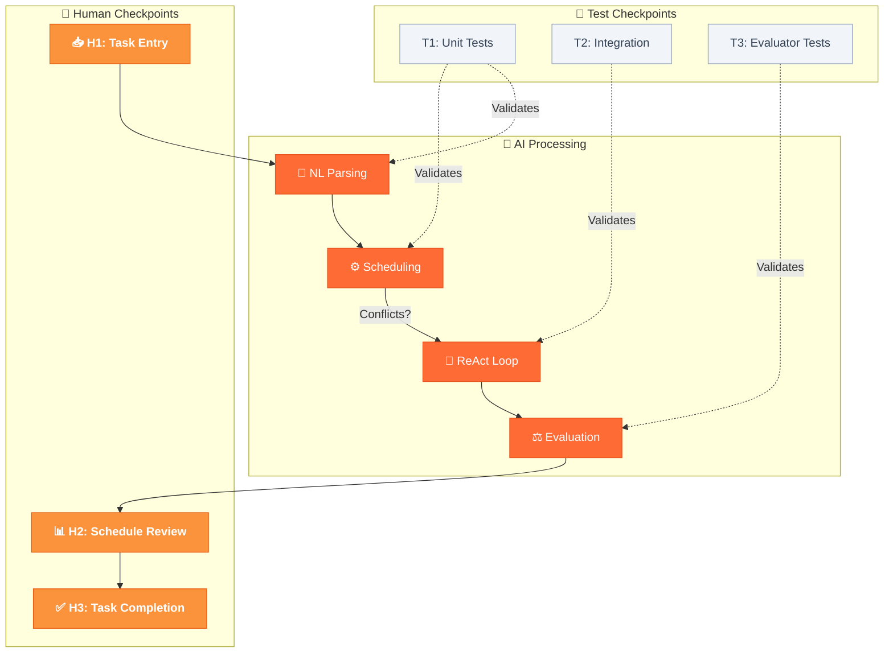

# PawPal+ System Diagrams

This document contains the raw Mermaid source code for all project visualizations.

## 1. System Architecture Overview

```mermaid
graph TB
    %% ── CLASS DEFINITIONS ───────────────────────────────────────────────────
    classDef ui        fill:#101B35,stroke:#1A2E55,color:#FFFFFF,font-weight:bold
    classDef agent     fill:#FF6B35,stroke:#E8531E,color:#FFFFFF,font-weight:bold
    classDef core      fill:#2EC4B6,stroke:#1EA89B,color:#FFFFFF
    classDef data      fill:#F1F5F9,stroke:#CBD5E1,color:#101B35
    classDef audit     fill:#F8FAFC,stroke:#E2E8F0,color:#64748B,font-style:italic

    subgraph UI["🖥️ UI Layer (Streamlit)"]
        CHAT["💬 Chat Assistant<br/>(NL input)"]
        GANTT["📊 Gantt Chart<br/>(schedule view)"]
        SIDEBAR["⚙️ Sidebar<br/>(Admin controls)"]
    end

    subgraph AGENT["🧠 Agent Layer"]
        ORCH["⚙️ Orchestrator<br/>(coordinates workflow)"]
        PARSER["🤖 NL Parser<br/>(Claude Haiku 4.5)"]
        REACT["🔄 ReAct Loop<br/>(Claude Sonnet 4.6)"]
        GUARD["⚖️ Evaluator<br/>(Safety validator)"]
        TOOLS["🛠️ Tool Registry<br/>(9 callable tools)"]
    end

    subgraph CORE["🛡️ Core Scheduling"]
        RETRIEVER["🔍 Context Retriever<br/>(get_all_tasks)"]
        SCHED["🗓️ Scheduler<br/>(2-phase logic)"]
        CONFLICT["🔍 Conflict Detector<br/>(Sweep-line)"]
    end

    subgraph DATA["💾 Data Layer"]
        OWNER["Owner"]
        PET["Pet"]
        TASK["Task"]
    end

    subgraph AUDIT["📈 Observability"]
        TRACE["📜 Reasoning Trace<br/>(Audit trail)"]
        METRICS["📊 RunMetrics<br/>(Tokens/Latency)"]
        TESTER["🧪 Tester<br/>(Unit & Integration)"]
    end

    %% Apply Classes
    class CHAT,GANTT,SIDEBAR ui
    class ORCH,PARSER,REACT,GUARD,TOOLS agent
    class RETRIEVER,SCHED,CONFLICT core
    class OWNER,PET,TASK data
    class TRACE,METRICS,TESTER audit

    %% Flows
    CHAT & SIDEBAR --> ORCH
    ORCH --> PARSER & REACT & GUARD
    REACT --> TOOLS
    ORCH --> RETRIEVER
    RETRIEVER --> TOOLS
    TOOLS --> SCHED & CONFLICT
    SCHED --> CONFLICT
    GANTT --- SCHED
    GUARD --> TRACE
    ORCH --> METRICS
    OWNER --> PET --> TASK
    TESTER -.->|Validates| SCHED & CONFLICT
```

---

## 2. Data Flow (Input → Process → Output)

```mermaid
flowchart LR
    %% ── CLASS DEFINITIONS ───────────────────────────────────────────────────
    classDef user      fill:#FB923C,stroke:#EA580C,color:#FFFFFF,font-weight:bold
    classDef input     fill:#101B35,stroke:#1A2E55,color:#FFFFFF
    classDef logic     fill:#2EC4B6,stroke:#1EA89B,color:#FFFFFF
    classDef agent     fill:#FF6B35,stroke:#E8531E,color:#FFFFFF
    classDef output    fill:#152B50,stroke:#101B35,color:#FFFFFF

    U(["👤 Owner"])

    subgraph INPUT["📥 Input"]
        NL["💬 NL Request"]
        FORM["📝 Structured Form"]
    end

    subgraph PARSE["⚙️ Parse & Filter"]
        HAIKU["🤖 NL Parser"]
        FILTER["🧹 Temporal Filter"]
        RETR["🔍 Context Retriever"]
    end

    subgraph SCHEDULE["🛡️ Schedule"]
        P1["Phase 1: Required"]
        P2["Phase 2: Optional"]
        CD["🔍 Conflict Detector"]
    end

    subgraph RESOLVE["🧠 Resolve"]
        SONNET["🔄 ReAct Agent"]
        EVAL["⚖️ Evaluator"]
    end

    subgraph OUTPUT["📱 Output"]
        GANT["📊 Gantt Chart"]
        LOG["📜 Audit Log"]
    end

    class U user
    class NL,FORM input
    class HAIKU,FILTER,RETR,P1,P2,CD logic
    class SONNET,EVAL agent
    class GANT,LOG output

    U --> NL & FORM
    NL --> HAIKU --> RETR --> FILTER
    FORM --> FILTER
    FILTER --> P1 --> P2 --> CD
    CD -->|"No Conflicts"| GANT
    CD -->|"Conflicts Found"| SONNET --> EVAL --> GANT
    EVAL & SONNET --> LOG
```

---

## 3. Human-in-the-Loop & Testing Checkpoints

